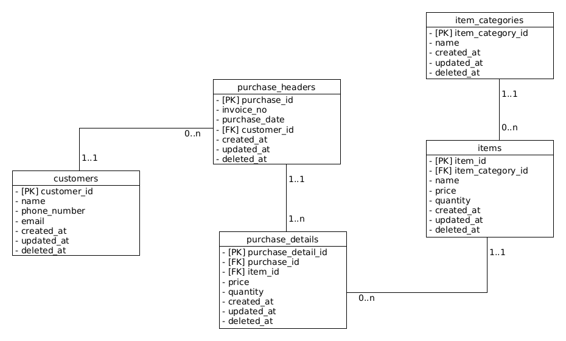

# Advance Topic

## demo shop_db

In this database, we want to introduce how to read ERD. Also, we want to know how to implement from ERD to become a Database. The tables has been normalized. By using this example, we can demo various DML and DQL.

## The ERD



## Database indexing

- an index makes the query fast

- data structure which contains copy of indexed data
  - require space
  - helps dbms to find data in the actual table
- [Reference](https://use-the-index-luke.com/sql/preface)
- [`Standard Names for indexes in PostgreSQL`](https://gist.github.com/popravich/d6816ef1653329fb1745)

- create index

  ```sql
      -- complete syntax
      CREATE INDEX index_name ON table_name [USING method]
      (
          column_name [ASC | DESC] [NULLS {FIRST | LAST }],
          ...
      );
      -- common
      CREATE INDEX index_name ON table_name (column_name);

      -- see list index
      SELECT
      tablename,
      indexname,
      indexdef
      FROM
          pg_indexes
      WHERE
          schemaname = 'public'
      ORDER BY
          tablename,
          indexname;
  ```

- drop index

  ```sql
  DROP INDEX index_name
  ```

- [indexing strategies](https://docs.oracle.com/cd/B14117_01/appdev.101/b10795/adfns_in.htm#1006333)

## Views

- A view is a database object that is of a stored query. A view can be accessed as a virtual table in SQL.

- View is a logical table that represents data of one or more underlying tables through a SELECT statement. Notice that a view does not store data physically except for a materialized view.

- [source](https://www.postgresqltutorial.com/postgresql-views/)

## Stored Procedures

- The store procedures define functions for creating triggers or custom aggregate functions. In addition, stored procedures also add many procedural features e.g., control structures and complex calculation. These allow you to develop custom functions much easier and more effective.

  ```sql
  create [or replace] procedure procedure_name(parameter_list)
  language plpgsql
  as $$
  declare
  -- variable declaration
  begin
  -- stored procedure body
  end; $$
  ```

  - disadvantages using stored procedure:
    - cannot do unit test
    - not scalable
    - managing code can be challenging ()

## SQL Transaction

- A database transaction is a single unit of work that consists of one or more operations.

- [source](https://www.postgresqltutorial.com/postgresql-tutorial/postgresql-transaction/)
