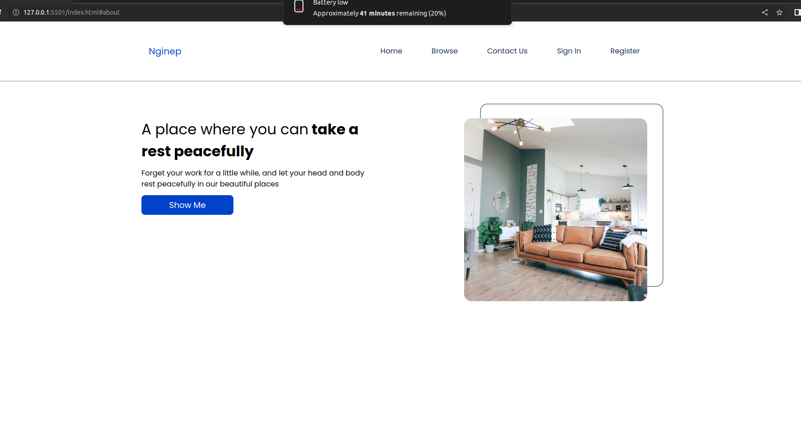
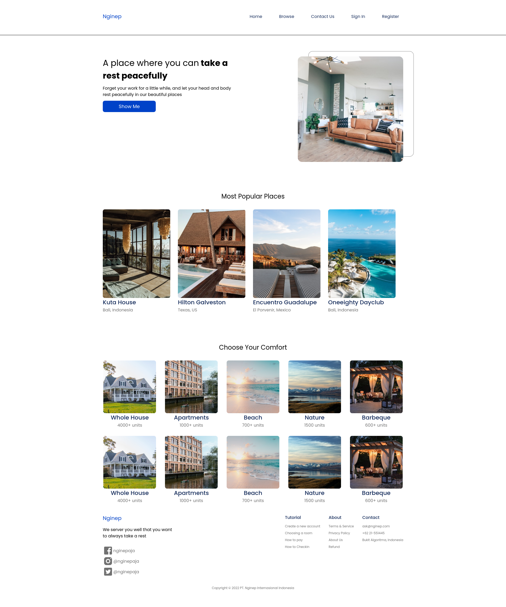

# exercise-web-basic

This is base repo for exercise:

1. Intro HTML & CSS
2. Responsive Web (CSS)
3. Bootstrap
4. JavaScript DOM

Links:

- [Mockup Figma (Nginep)](https://www.figma.com/file/DfAvyxyav1aBcDkfQdPIlW/Nginep?node-id=0%3A1&t=iRR8redypOMSuTP7-0)
- [Live Server VS Code Extension](https://marketplace.visualstudio.com/items?itemName=ritwickdey.LiveServer)
- [CSS Reset](https://piccalil.li/blog/a-modern-css-reset/)

### 1. Exercise Intro HTML & CSS

Create the Navigation and Hero section of Home page.
Rules:

- Check Mockup in Figma for detail about the design.
- You may use Flexbox and/or Grid if you want
- Responsive is not necessary
  

### 2. Exercise Responsive Web (CSS)

Create **Home** page both Desktop and Mobile version.
Rules:

- Must responsive
- Use Flexbox and Grid
- Don't use Bootstrap

### 3. Exercise Bootstrap

Create **Browse** page both Desktop and Mobile version.
Rules:

- Use Bootstrap
- You may overwrite Bootstrap style to match the design in Figma

### 4. Exercise JavaScript DOM

Create **Contact Us** page Desktop version only.
Rules:

- Use Vanilla JavaScript
- Please add validation like empty field, string or number only, etc

### hasil

